# Data Visualization with R

### This document is a compilation of visualization of different data including data from research, and the data retrieved from different data bases

### importing packages of R using *library* function

> library(multcompView)
library(dplyr)
library(ggprism)
library(ggthemes)
library(ggtext)
library(tidyverse)
library(plotly)
library(ggplot2) 
library(remotes)
library(viridis)
library(ggfx)
library(ggsignif)
library(tidyr)
library(agricolae)
library(hrbrthemes)
library(ggpubr)
library(MetBrewer)
library(plotrix)
library(cowplot)
library(ggpmisc)
library(NatParksPalettes)
library(ggdist)
library(gghalves)
library(ggforce)
library(viridis)
library(ggcorrplot)
library(corrplot)
library(factoextra)
library(FactoMineR)
library(gifski)
library(png)
library(gganimate)
library(plotfunctions)


>## Publication ready bar graphs from a research data

```{r}
library(readxl)
w1 <- read_excel("Wheat-Letterings.xlsx", 
                 sheet = "2017-18", col_types = c("text", 
                                                  "numeric", "numeric", "text", "text", 
                                                  "numeric", "numeric", "text", "text", 
                                                  "numeric", "numeric", "text", "text", 
                                                  "numeric", "numeric", "text", "text"))

w1<-w1
w1$trt<-factor(w1$trt,
                  levels = c("R1W1", "R2W1","R3W1", 
                             "R1W2","R2W2","R3W2", "R1W3","R2W3","R3W3"))
View(w1)
```

```{r}
###penical per m2

p1<-ggplot(w1, aes(trt,mean_p, fill=trt))+
  geom_bar(stat = "Identity", position = position_dodge2(), show.legend = FALSE, alpha=0.65)+
  theme_bw()+
  geom_errorbar(aes(ymin=mean_p-se1, ymax=mean_p+se1), vjust=-0.5, width=0.2)+
  geom_text(aes(label=lt1, y=mean_p+se1), vjust=-0.5)+
  theme(panel.grid = element_blank(), 
        axis.text = element_text(size=12, colour = "black", family = "Roboto Mono"),
        axis.title = element_text(size = 14, face = "bold"), 
        axis.text.x = element_text(angle = 45, vjust = 0.7),
        axis.title.x = element_blank(), 
        axis.text.x.bottom = element_blank(), 
        axis.ticks.x = element_blank())+
  labs(x="Treatments", y="Penicles per m2")+
  scale_fill_manual(values = met.brewer("Juarez", 10))
p1
```
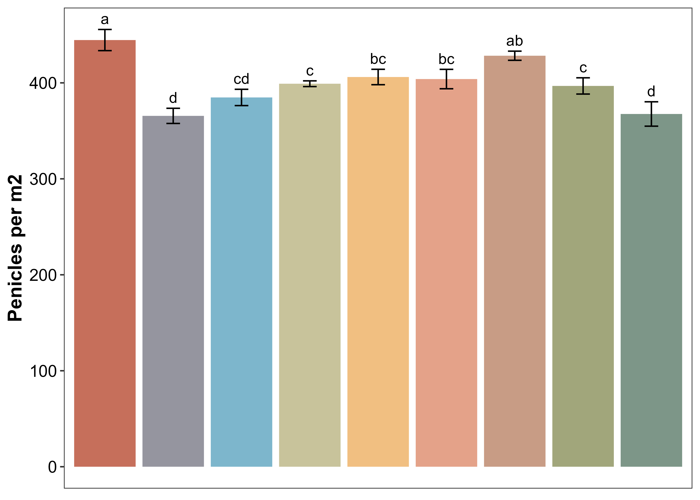
```{r}
##SN/p

p2<-ggplot(w1, aes(trt,mean_snp, fill=trt))+
  geom_bar(stat = "Identity", position = position_dodge2(), show.legend = FALSE, alpha=0.65)+
  theme_bw()+geom_errorbar(aes(ymin=mean_snp-se2, ymax=mean_snp+se2), vjust=-0.5, width=0.2)+
  geom_text(aes(label=lt2, y=mean_snp+se2), vjust=-0.5)+
  theme(panel.grid = element_blank(), 
        axis.text = element_text(size=12, colour = "black"),
        axis.title = element_text(size = 14, face = "bold"),
        axis.text.x = element_text(angle = 45, vjust = 0.7),
        axis.title.x = element_blank(), 
        axis.text.x.bottom = element_blank(), 
        axis.ticks.x = element_blank())+
  labs(x="Treatments", y="SN/P")+
  scale_fill_manual(values = met.brewer("Juarez", 10))
p2
```
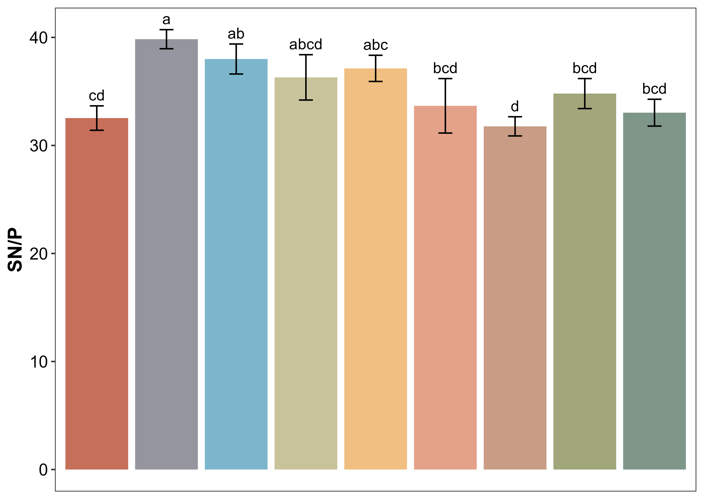
```{r}
###GW

p3<-ggplot(w1, aes(trt,mean_gw, fill=trt))+
  geom_bar(stat = "Identity", position = position_dodge2(), show.legend = FALSE, alpha=0.65)+
  theme_bw()+
  geom_errorbar(aes(ymin=mean_gw-se3, ymax=mean_gw+se3), vjust=-0.5, width=0.2)+
  geom_text(aes(label=lt3, y=mean_gw+se3), vjust=-0.5)+
  theme(panel.grid = element_blank(), axis.text = element_text(size=12, colour = "black"),
        axis.title = element_text(size = 14, face = "bold"), 
        axis.text.x = element_text(angle = 45, vjust = 0.9, hjust = 0.9))+
  labs(x="Treatments", y="Grain Weight (g)")+
  scale_fill_manual(values = met.brewer("Juarez", 10))
p3
```
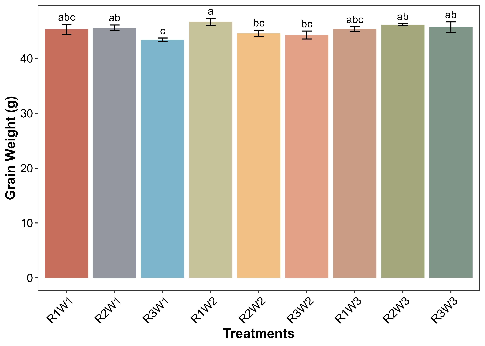
```{r}
###yield

p4<-ggplot(w1, aes(trt,mean_yield, fill=trt))+
  geom_bar(stat = "Identity", position = position_dodge2(), show.legend = FALSE, alpha=0.65)+
  theme_bw()+
  geom_errorbar(aes(ymin=mean_yield-se4, ymax=mean_yield+se4), vjust=-0.5, width=0.2)+
  geom_text(aes(label=lt4, y=mean_yield+se4), vjust=-0.5)+
  theme(panel.grid = element_blank(), axis.text = element_text(size=12, colour = "black"),
        axis.title = element_text(size = 14, face = "bold"), 
        axis.text.x = element_text(angle = 45, vjust = 0.9, hjust = 0.9))+
  labs(x="Treatments", y="Yield (t/ha)")+
  scale_fill_manual(values = met.brewer("Juarez", 10))
p4

```
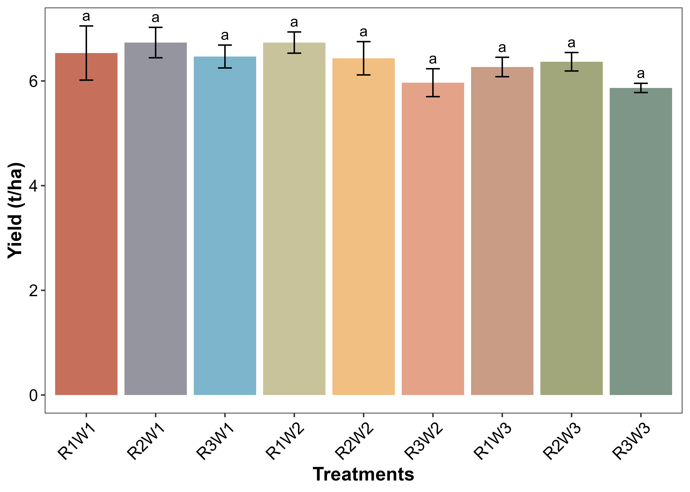

```{r}
ggarrange(p1, p2,p3,p4, nrow = 2, ncol = 2, align = "v", font.label = list(size=16),
          hjust = c(-5.5,-5.5, -5.5, -5.5), vjust = c(1.3,1.8,1.8, 1.8))
  #ggsave("wheat2017-18(lettering).jpeg", width = 8, height = 8, dpi = 600)
```
.jpeg)

>## Correlation calculation and visualization

```{r}
library(readxl)
x1 <- read_excel("Corelation file sent to wajid-R1.xlsx")
View(x1)
```

```{r}
c<-cor(x1[, -1:-2])
c
```

```{r}
ggcorrplot(c,  method="square", hc.order = FALSE, 
           outline.col = "white",colors = c("#E46726", "white","#6D9EC1"), 
           legend.title = "Correlation")
```
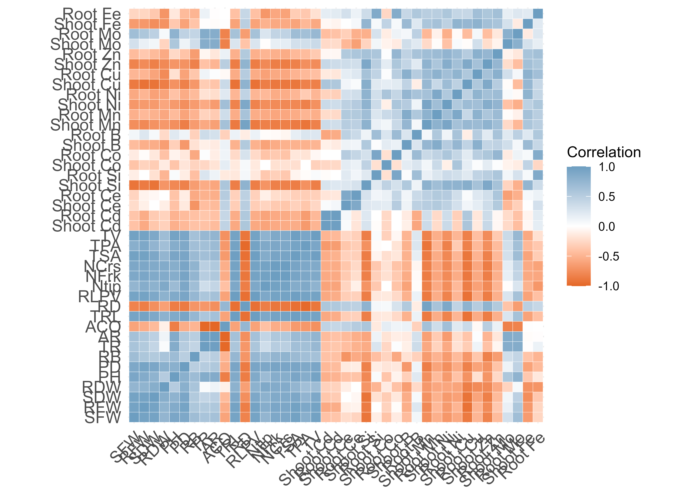

>## Further customization of correlation plots can be done by below codes
```{r}
corrplot(c, order = "hclust", addrect = 4)

corrplot(c, method = "number")
### upper corr plot
corrplot(c, method = "number", type = "upper")
### lower corr plot
corrplot(c, method = "number", type = "lower")
###mixed corr plot
corrplot.mixed(c, lower = "number", upper = "pie", order="AOE")
###clustring
corrplot(c, order = "hclust", addrect = 4)
```
## PCA analysis and visualization

```{r}
x<- prcomp(x1[, -1:-2], center = TRUE, scale. = TRUE)
print(x)
summary(x)

```

```{r}
x3<-cbind(x1, x$x)
x3

```

```{r}
ggplot(x3, aes(PC1, PC2, col=groups, label=groups))+geom_point(size=5)+
  geom_text(size=6,hjust=0, vjust=0, check_overlap = T)
```
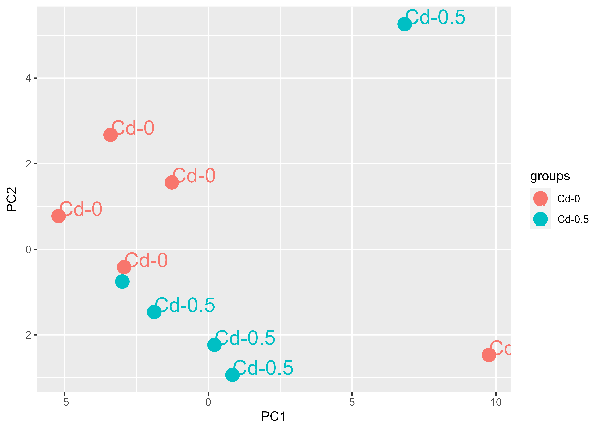
```{r}
mp<-ggplot(x3, aes(PC1, PC2,col=trt, fill=groups))+stat_ellipse(geom = "polygon", col="black", alpha=0.5)+
  geom_point(shape=21, col="black", size=4)+theme_bw()+theme(panel.grid.major = element_blank(), panel.grid.minor = element_blank())
mp
```
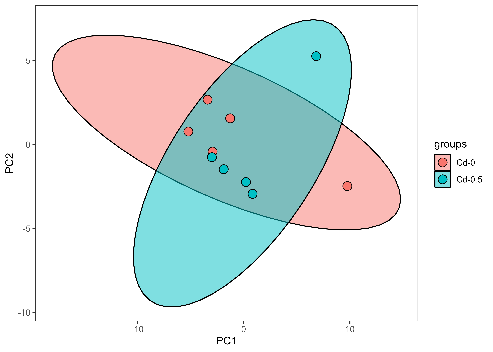
```{r}
x3.pca<-PCA(x1[, -1:-2], graph = TRUE, scale.unit = TRUE)
```

```{r}
fviz_eig(x3.pca, addlabels = TRUE)

fviz_pca_var(x3.pca, col.var = "cos2", gradient.col=c("Green","Blue","Pink","Purple"),repel = TRUE)+
  labs(title = "PCA variable plot", x="PC1 (55.2%)", y="PC2 (16.4%)", colour="cos2")
```
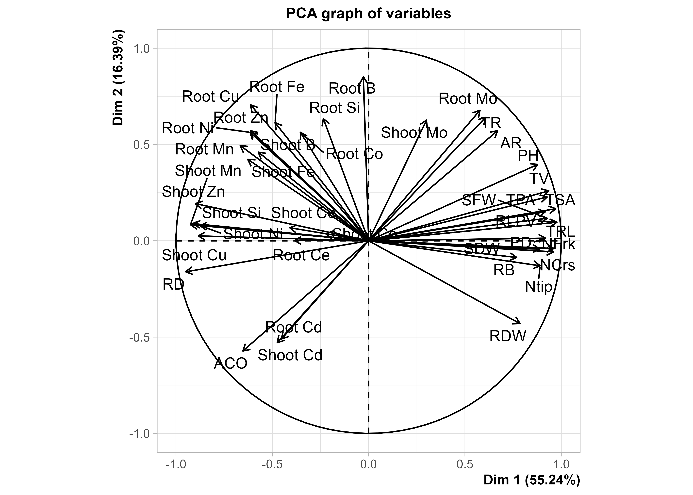
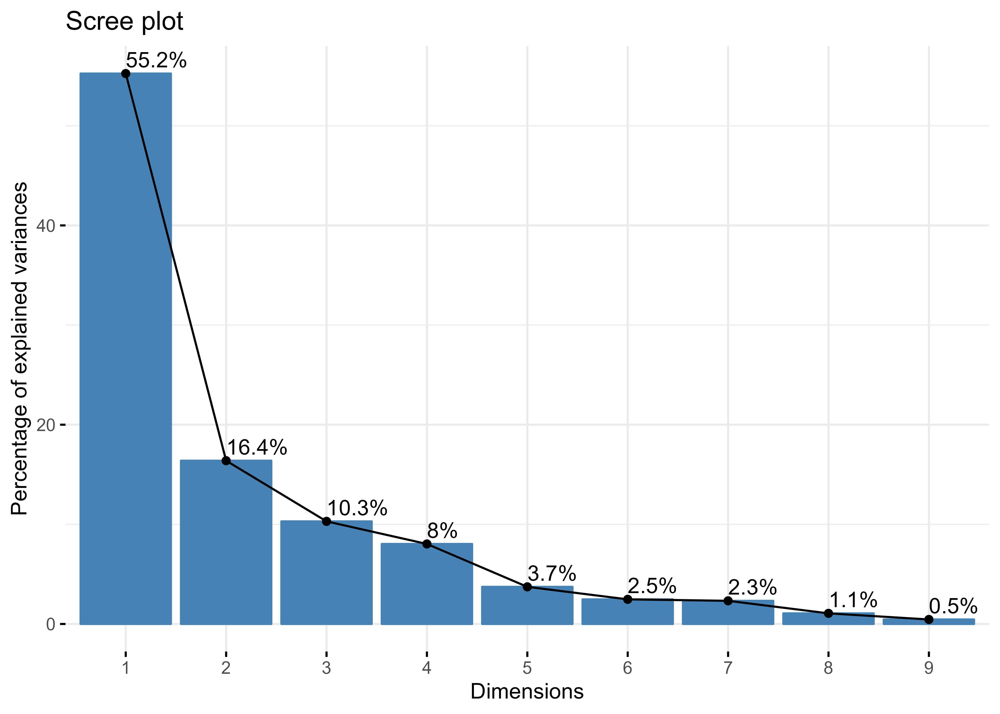
>## Line plot of global fertilizer use (Data retrieved from FAO database)

```{r}
library(readr)
df3 <- read_csv("fertilizer use.csv", 
                col_types = cols(Year = col_number(), 
                                                       Value = col_number()))

df5<-filter(df3, Area=="World") %>% 
  mutate(value1=Value/1000000)

```

```{r}
ggplot(df5, aes(Year, value1))+geom_line(color="gray")+
  geom_point(fill="red", color="gray", size=2, alpha=.7, 
             show.legend = FALSE, shape=21)+
  geom_smooth(size=0.9, se=FALSE, span=0.15, color="black")+
  scale_x_continuous(breaks = seq(2000, 2020, 1), expand = c(0,0.2))+
  scale_y_continuous(limits = c(80, 110), expand = c(0,0))+
  theme_light()+
  theme(axis.ticks = element_blank(),
        plot.title.position = "plot",
        plot.title = element_text(margin = margin(b=10), 
                                  color="#018d8e", face="bold"),
        plot.subtitle = element_text(size = 8, margin = margin(b=10)),
        axis.text.x = element_text(angle = 35, size = 9, hjust = 1, vjust = 1),
        panel.grid = element_blank())+
  labs(x="", y="Nitrogen Fertilizer (Tg)",
  title="Global Nitrogenous Fertilizers Use in Agriculture (2000-2019)",
  subtitle = "Data source:Food and Agriculture Organization (https://www.fao.org/faostat/)")
```
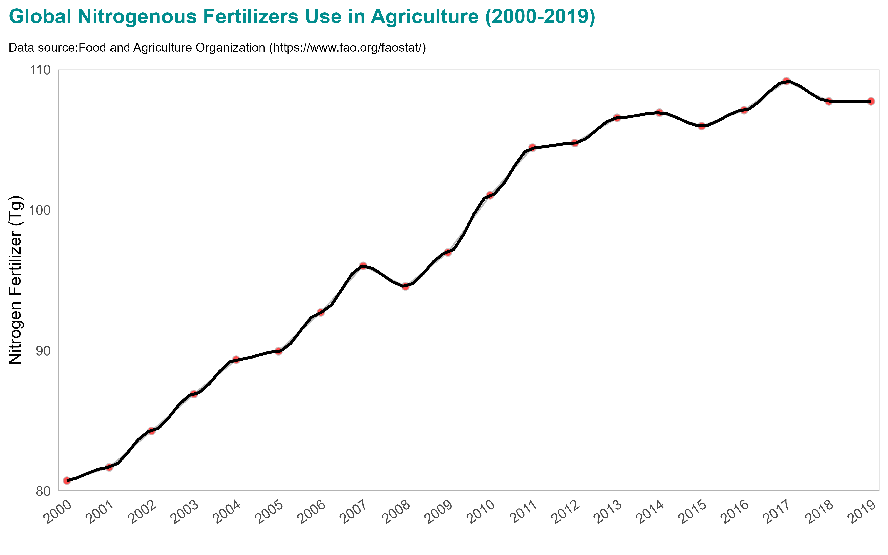
>## Lollipop graph of N2O emission factors

```{r}
library(readr)
df2 <- read_csv("emission factor.csv", col_types = cols(factor = col_number()))
```

```{r}
ggplot(df2, aes(x = factor, y = country, label=soil)) +
  geom_segment(aes(yend = country), xend = 0, colour = "grey50",
               show.legend = FALSE) +
  geom_point(size = 3, aes(colour = soil), 
             show.legend = FALSE, alpha=0.70) +
  scale_colour_manual(values = met.brewer("Austria", 17)) +
  theme_bw() +
  theme(
    panel.grid.major.y = element_blank(),   # No horizontal grid lines
    legend.position = c(1, 0.55),           # Put legend inside plot area
    legend.justification = c(1, 0.5),
  axis.text = element_text(size = 9), axis.title = element_text(size = 9), axis.text.y = element_text(size = 9))+
  geom_text(check_overlap = TRUE, vjust=-1, size=1.5)+
  labs(x="Emission factor (% N2O/kg N)",y="" ,
       caption = "Data Source: (Walling and Vaneeckhaute, 2020)")
```
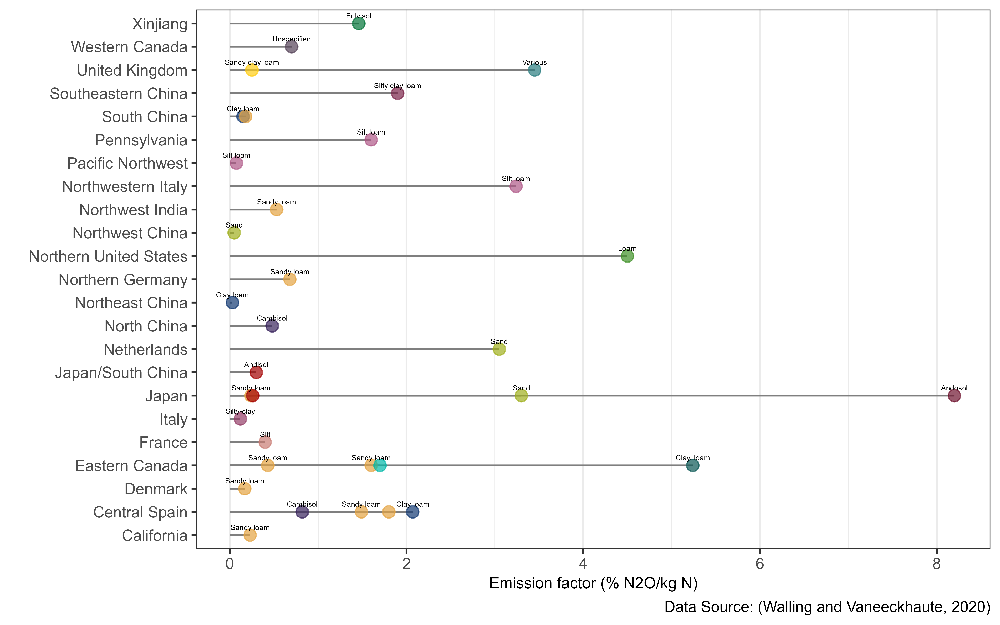
>## Data distribution graphs

```{r}
library(readxl)
df6 <- read_excel("n2o.xlsx", sheet = "sandy_loam_flux")
 
  df6$type<-factor(df6$type, levels = c("Control", "Uncoated Urea",
                                      "Bentonite coated Urea", "NPs coated Urea"))
df6_new<-df6 %>% 
    pivot_longer(-type, names_to = "rep", values_to = "value")

df6_new[df6_new<0]<-NA
df6_new
```
>## Combination of *geom_jitter*, *geom_boxplot* and *ggdist*

```{r}
p1<-ggplot(df6_new, aes(x = type, y = value, col=type)) + 
  ## add half-violin from {ggdist} package
  ggdist::stat_halfeye(
    ## custom bandwidth
    adjust = .5, 
    ## adjust height
    width = .6, 
    ## move geom to the right
    justification = -.2, 
    ## remove slab interval
    .width = 0, aes(slab_fill=type, alpha=0.7), show.legend = FALSE
  ) + 
  geom_boxplot(
    width = .12, 
    ## remove outliers
    outlier.color = NA, show.legend = FALSE ## `outlier.shape = NA` works as well
  ) +
  ## add dot plots from {ggdist} package
  ggdist::stat_dots(
    ## orientation to the left
    side = "left", 
    ## move geom to the left
    justification = 1.1, 
    ## adjust grouping (binning) of observations 
    binwidth = 1
  , show.legend = FALSE) + 
  ## remove white space on the left
  coord_cartesian(xlim = c(1.2, NA))+
  guides(y = "prism_offset_minor")+
  theme_prism(base_size = 12)+
  labs(x="", y="N2O flux (ug N m-2 h-1)")+
  theme(panel.grid = element_blank(),
        axis.text = element_text(size = 11),
        axis.title = element_text(size = 12))
p1
```
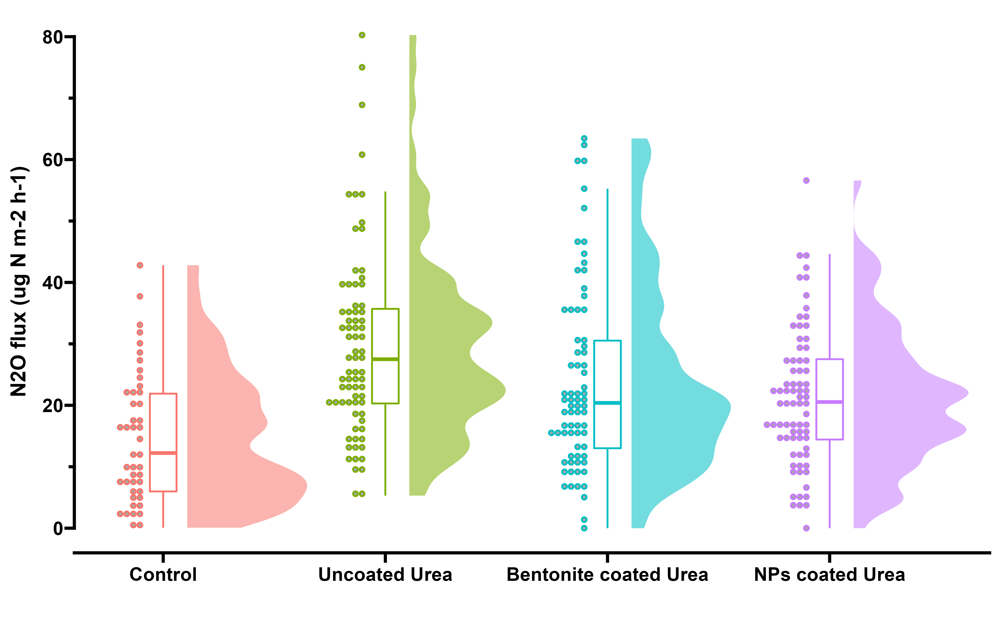
## Voilin plot in combination with jitter and boxplot plot

```{r}
p2<-ggplot(df6_new, aes(type, value, col=type))+
    geom_jitter(size=2, show.legend = FALSE, alpha=0.65)+
    geom_violin(fill=NA,show.legend = FALSE, trim = FALSE)+
    geom_boxplot(width=0.2, color="black", alpha=0.3,show.legend = FALSE)+
    stat_summary(fun = "mean",
                 geom = "point",
                 color="red", size=3, na.rm = TRUE)+
    scale_y_continuous(breaks = seq(-40, 100, 20))+
    guides(y = "prism_offset_minor")+
  theme_prism(base_size = 12)+
    theme(panel.grid = element_blank(),
          axis.text.x = element_blank(),
          axis.ticks.x = element_blank())+
    labs(x="", y="N2O flux (ug N m-2 h-1)")+
    scale_color_manual(values = natparks.pals("Olympic", 4))
p2
```
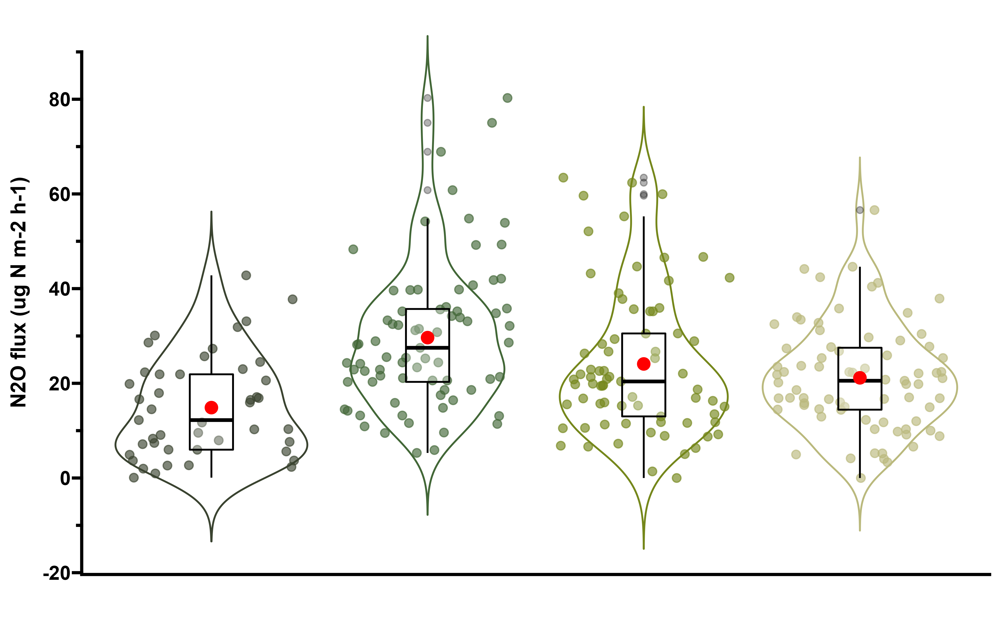
## Animated Gif graph

```{r}
library(readxl)
co2 <- read_excel("ban, pak, ind.xls", col_types = c("text", 
                                                     "text", "text", "numeric", "numeric"))
```

```{r}
g<-ggplot(co2, aes(Year, Value, color=Countries))+geom_line(lwd=1.5)+geom_point(size=2, shape= 17, color="black")+theme_bw()+
  ggtitle("Share of Agricultural land use in total CO2 emmisions")+
  scale_x_continuous(breaks = c(1990,1992,1994,1996,1998,2000,2002,2004,2006,2008,2010,2012,2014,2017))+
  scale_y_continuous()+labs(x= "Year(1990-2017)",y="Value (%)")+theme(axis.text = element_text(size=11))+
  theme(legend.text = element_text(size=14))+
  theme(axis.title =element_text(size=14, face = "bold"))+theme(plot.title = element_text(size=16, face="bold"))+transition_reveal(Year)
g 
#animate(fps=10,width=750, height=450)
```


