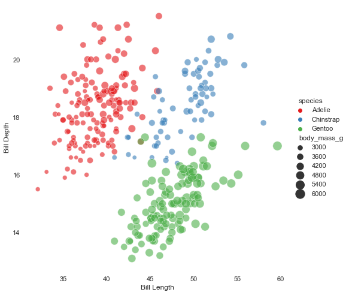

# **Classification Problem**
## ***Penguins Data***

A ***Penguins*** data set from Kaggle database chose to perform the machine learning (ML) algorithms, used for classification.\
I used three ML algoriths: ***Decision Tree Classifier***, ***Random Forest Classifier*** and ***Support Vector Machine***\
The libraries are imported in the first step.


```python
import pandas as pd # For data importing and manipulation/data wrangling
import numpy as np # Basic mathemitics
import seaborn as sns ## Data visualization
import matplotlib.pyplot as plt ## Data visualization
```

The data is imported from a csv file using a function from pandas library


```python
df=pd.read_csv("penguins_size.csv") # Data importing from CSV file
df.head() # Viewing first few lines of imported data
```


<div>
<style scoped>
    .dataframe tbody tr th:only-of-type {
        vertical-align: middle;
    }

    .dataframe tbody tr th {
        vertical-align: top;
    }

    .dataframe thead th {
        text-align: right;
    }
</style>
<table border="1" class="dataframe">
  <thead>
    <tr style="text-align: right;">
      <th></th>
      <th>species</th>
      <th>island</th>
      <th>culmen_length_mm</th>
      <th>culmen_depth_mm</th>
      <th>flipper_length_mm</th>
      <th>body_mass_g</th>
      <th>sex</th>
    </tr>
  </thead>
  <tbody>
    <tr>
      <th>0</th>
      <td>Adelie</td>
      <td>Torgersen</td>
      <td>39.1</td>
      <td>18.7</td>
      <td>181.0</td>
      <td>3750.0</td>
      <td>MALE</td>
    </tr>
    <tr>
      <th>1</th>
      <td>Adelie</td>
      <td>Torgersen</td>
      <td>39.5</td>
      <td>17.4</td>
      <td>186.0</td>
      <td>3800.0</td>
      <td>FEMALE</td>
    </tr>
    <tr>
      <th>2</th>
      <td>Adelie</td>
      <td>Torgersen</td>
      <td>40.3</td>
      <td>18.0</td>
      <td>195.0</td>
      <td>3250.0</td>
      <td>FEMALE</td>
    </tr>
    <tr>
      <th>3</th>
      <td>Adelie</td>
      <td>Torgersen</td>
      <td>NaN</td>
      <td>NaN</td>
      <td>NaN</td>
      <td>NaN</td>
      <td>NaN</td>
    </tr>
    <tr>
      <th>4</th>
      <td>Adelie</td>
      <td>Torgersen</td>
      <td>36.7</td>
      <td>19.3</td>
      <td>193.0</td>
      <td>3450.0</td>
      <td>FEMALE</td>
    </tr>
  </tbody>
</table>
</div>


Missing values has been viewed using the below function. It can be seen that there some missing values in the data set.


```python
df.isnull().sum() ## To check the missing values in a data set
```


    species               0
    island                0
    culmen_length_mm      2
    culmen_depth_mm       2
    flipper_length_mm     2
    body_mass_g           2
    sex                  10
    dtype: int64


It is important to address the missing values in a data set to get the best results from a fitted a model. I replaced the missing values in contineous variables by the mean of that column, while the missing values in the categorical variable are replaced with the mode value in that column.\
Below given are the code details.


```python
mean=df["culmen_length_mm"].mean() ## Mean calculation
mean1=df["culmen_depth_mm"].mean()
mean2=df["flipper_length_mm"].mean()
mean3=df["body_mass_g"].mean()
mode=df["sex"].mode() ## Mode identification
mode
```


    0    MALE
    dtype: object


```python
df["culmen_length_mm"]=df["culmen_length_mm"].fillna(mean) ## Replacing the missing values with the mean of the respective column
df["culmen_depth_mm"]=df["culmen_depth_mm"].fillna(mean1)
df["flipper_length_mm"]=df["flipper_length_mm"].fillna(mean2)
df["body_mass_g"]=df["body_mass_g"].fillna(mean3)
df["sex"]=df["sex"].fillna("MALE")
df["sex"]=df["sex"].replace(".", "MALE") ## Replacing the missing value with the mode of the respective column
```

Below you can see that all the missing values are addressed.


```python
df.isnull().sum() ## Confirming the missing values replacement
```


    species              0
    island               0
    culmen_length_mm     0
    culmen_depth_mm      0
    flipper_length_mm    0
    body_mass_g          0
    sex                  0
    dtype: int64


As we can see in the imported data that some variables are contineous while some of them are categorical. So in the next step I converted the categorical variales into the contineous variables by converting them to the dummy variables.


```python
df["sex"].value_counts() ### Counting the number of segments in a variable
```


    MALE      179
    FEMALE    165
    Name: sex, dtype: int64


```python
df["island"].value_counts()
```


    Biscoe       168
    Dream        124
    Torgersen     52
    Name: island, dtype: int64


```python
df["sex"]=df["sex"].replace("MALE", 1) # Replacing the strings with the dummy variables
df["sex"]=df["sex"].replace("FEMALE", 0)
```


```python
df["island"]=df["island"].replace("Biscoe", 1)
df["island"]=df["island"].replace("Dream", 2)
df["island"]=df["island"].replace("Torgersen", 1)
```


```python
df.head()
```


<div>
<style scoped>
    .dataframe tbody tr th:only-of-type {
        vertical-align: middle;
    }

    .dataframe tbody tr th {
        vertical-align: top;
    }

    .dataframe thead th {
        text-align: right;
    }
</style>
<table border="1" class="dataframe">
  <thead>
    <tr style="text-align: right;">
      <th></th>
      <th>species</th>
      <th>island</th>
      <th>culmen_length_mm</th>
      <th>culmen_depth_mm</th>
      <th>flipper_length_mm</th>
      <th>body_mass_g</th>
      <th>sex</th>
    </tr>
  </thead>
  <tbody>
    <tr>
      <th>0</th>
      <td>Adelie</td>
      <td>1</td>
      <td>39.10000</td>
      <td>18.70000</td>
      <td>181.000000</td>
      <td>3750.000000</td>
      <td>1</td>
    </tr>
    <tr>
      <th>1</th>
      <td>Adelie</td>
      <td>1</td>
      <td>39.50000</td>
      <td>17.40000</td>
      <td>186.000000</td>
      <td>3800.000000</td>
      <td>0</td>
    </tr>
    <tr>
      <th>2</th>
      <td>Adelie</td>
      <td>1</td>
      <td>40.30000</td>
      <td>18.00000</td>
      <td>195.000000</td>
      <td>3250.000000</td>
      <td>0</td>
    </tr>
    <tr>
      <th>3</th>
      <td>Adelie</td>
      <td>1</td>
      <td>43.92193</td>
      <td>17.15117</td>
      <td>200.915205</td>
      <td>4201.754386</td>
      <td>1</td>
    </tr>
    <tr>
      <th>4</th>
      <td>Adelie</td>
      <td>1</td>
      <td>36.70000</td>
      <td>19.30000</td>
      <td>193.000000</td>
      <td>3450.000000</td>
      <td>0</td>
    </tr>
  </tbody>
</table>
</div>


As we are done with the data cleaning/manipulation, our next step is to divide the data into feature variables and the target variable. After dividing we will store the feature variables into the X variable and the target variable into the y variable


```python
X=df.iloc[:,-6:] ### Feature variables
y=df["species"] ## Target variable
```

We will split the data into training and testing data 


```python
from sklearn.model_selection import train_test_split
X_train, X_test, y_train, y_test=train_test_split(X,y, test_size=0.2, random_state=0) ## Spliting data into two parts 80% training data
                                                                                        #20% test data
```

Model training is carried out using the training data


```python
from sklearn.tree import DecisionTreeClassifier
model=DecisionTreeClassifier().fit(X_train, y_train) ### Training of model using training data
```

For prediction we used the test data


```python
y_pred=model.predict(X_test)  ### Prediction of test data
y_pred 
```


    array(['Adelie', 'Adelie', 'Adelie', 'Gentoo', 'Adelie', 'Gentoo',
           'Adelie', 'Chinstrap', 'Gentoo', 'Adelie', 'Adelie', 'Gentoo',
           'Adelie', 'Gentoo', 'Gentoo', 'Adelie', 'Adelie', 'Gentoo',
           'Adelie', 'Adelie', 'Gentoo', 'Adelie', 'Chinstrap', 'Adelie',
           'Gentoo', 'Gentoo', 'Gentoo', 'Adelie', 'Adelie', 'Gentoo',
           'Gentoo', 'Chinstrap', 'Adelie', 'Adelie', 'Adelie', 'Chinstrap',
           'Gentoo', 'Chinstrap', 'Adelie', 'Adelie', 'Adelie', 'Adelie',
           'Adelie', 'Gentoo', 'Gentoo', 'Adelie', 'Gentoo', 'Chinstrap',
           'Adelie', 'Gentoo', 'Adelie', 'Adelie', 'Adelie', 'Adelie',
           'Adelie', 'Adelie', 'Adelie', 'Gentoo', 'Chinstrap', 'Gentoo',
           'Chinstrap', 'Chinstrap', 'Adelie', 'Gentoo', 'Gentoo', 'Gentoo',
           'Adelie', 'Gentoo', 'Gentoo'], dtype=object)


Visualizing the decision tree model


```python
### DT visualization
from sklearn.tree import plot_tree
plt.figure(figsize=(8,8))    ### figure size
plot_tree(model, filled=True) ###DT model
plt.title("Decision tree trained model (Penguins data)") ### Title of the plot
```


    Text(0.5, 1.0, 'Decision tree trained model (Penguins data)')


    

    


To see the accuracy of the model accuracy score is calculated and it can be seen that the model is very accurate with 98.55% accuracy


```python
from sklearn.metrics import accuracy_score
score=print("Accuracy score is:", accuracy_score(y_test, y_pred)*100)
```

    Accuracy score is: 98.55072463768117
    

To see the classification pattern, classification report is generated


```python
from sklearn.metrics import classification_report
print("Classification report",classification_report(y_test, y_pred))
```

    Classification report               precision    recall  f1-score   support
    
          Adelie       0.97      1.00      0.99        34
       Chinstrap       1.00      0.90      0.95        10
          Gentoo       1.00      1.00      1.00        25
    
        accuracy                           0.99        69
       macro avg       0.99      0.97      0.98        69
    weighted avg       0.99      0.99      0.99        69
    
    

Confusion matrix is the metrics used to see the problem in calssification, below the confusion matrix is extracted and visulaized in the form of heatmap


```python
from sklearn.metrics import confusion_matrix
cm=print("Confusion matrix is:", confusion_matrix(y_test, y_pred))
```

    Confusion matrix is: [[34  0  0]
     [ 1  9  0]
     [ 0  0 25]]
    


```python
##Heat map of confusion matrix
plt.figure(figsize=(9,9))
sns.heatmap(cm, annot=True, fmt=".3f", linewidth=.5, square=True,cmap="Spectral");
plt.ylabel("Actual output");
plt.xlabel("Predicted output");
all_sample_title="Accuracy score:{0}".format(score)
plt.title(all_sample_title, size=15);
```


    

    


# Random Forest classifier

On the same data another ML classification model ***Random Forest Classifier*** is also used. Almost all the steps are similar except the model used 


```python
from sklearn.model_selection import train_test_split
X_train, X_test, y_train, y_test=train_test_split(X,y, test_size=0.2, random_state=0) ### Data spliting
```


```python
from sklearn.ensemble import RandomForestClassifier
model1=RandomForestClassifier().fit(X_train, y_train) ### Model training
```


```python
y_pred1=model1.predict(X_test) ### Prediction of test data
y_pred1
```


    array(['Adelie', 'Adelie', 'Adelie', 'Gentoo', 'Adelie', 'Gentoo',
           'Adelie', 'Chinstrap', 'Gentoo', 'Adelie', 'Adelie', 'Gentoo',
           'Adelie', 'Gentoo', 'Gentoo', 'Adelie', 'Adelie', 'Gentoo',
           'Adelie', 'Adelie', 'Gentoo', 'Adelie', 'Chinstrap', 'Adelie',
           'Gentoo', 'Gentoo', 'Gentoo', 'Adelie', 'Adelie', 'Gentoo',
           'Gentoo', 'Chinstrap', 'Adelie', 'Adelie', 'Adelie', 'Chinstrap',
           'Gentoo', 'Chinstrap', 'Adelie', 'Adelie', 'Adelie', 'Adelie',
           'Adelie', 'Gentoo', 'Gentoo', 'Adelie', 'Gentoo', 'Chinstrap',
           'Adelie', 'Gentoo', 'Adelie', 'Adelie', 'Adelie', 'Adelie',
           'Adelie', 'Adelie', 'Adelie', 'Gentoo', 'Chinstrap', 'Gentoo',
           'Chinstrap', 'Chinstrap', 'Adelie', 'Gentoo', 'Gentoo', 'Gentoo',
           'Adelie', 'Gentoo', 'Gentoo'], dtype=object)


## Model accuracy/fitness

The Random forest calssifier showed exactly same accuracy like decison tree classifier model


```python
from sklearn.metrics import accuracy_score, classification_report, confusion_matrix
score=print("Accuracy score is:", accuracy_score(y_test, y_pred1)) ## Accuracy score
```

    Accuracy score is: 0.9855072463768116
    


```python
print("Classification report", classification_report(y_test, y_pred1)) ### Classification report
```

    Classification report               precision    recall  f1-score   support
    
          Adelie       0.97      1.00      0.99        34
       Chinstrap       1.00      0.90      0.95        10
          Gentoo       1.00      1.00      1.00        25
    
        accuracy                           0.99        69
       macro avg       0.99      0.97      0.98        69
    weighted avg       0.99      0.99      0.99        69
    
    


```python
cm1=confusion_matrix(y_test, y_pred1) ## Confusion matrix
```


```python
##Heat map of confusion matrix
plt.figure(figsize=(9,9))
sns.heatmap(cm1, annot=True, fmt=".3f", linewidth=.5, square=True,cmap="Spectral");
plt.ylabel("Actual output");
plt.xlabel("Predicted output");
all_sample_title="Accuracy score:{0}".format(score)
plt.title(all_sample_title, size=15);
```


    

    


# Support Vector Machine (SVM)
The next classification model is SVM


```python
from sklearn import svm
model2=svm.SVC(kernel="linear") ##Model import
model2.fit(X_train, y_train) ### Model training
```


    SVC(kernel='linear')


```python
y_pred2=model2.predict(X_test) ### Prediction
y_pred2
```


    array(['Adelie', 'Adelie', 'Adelie', 'Gentoo', 'Adelie', 'Gentoo',
           'Adelie', 'Chinstrap', 'Gentoo', 'Adelie', 'Adelie', 'Gentoo',
           'Adelie', 'Gentoo', 'Gentoo', 'Chinstrap', 'Adelie', 'Gentoo',
           'Adelie', 'Adelie', 'Gentoo', 'Adelie', 'Adelie', 'Adelie',
           'Gentoo', 'Gentoo', 'Gentoo', 'Adelie', 'Adelie', 'Gentoo',
           'Gentoo', 'Chinstrap', 'Adelie', 'Adelie', 'Adelie', 'Adelie',
           'Gentoo', 'Chinstrap', 'Adelie', 'Adelie', 'Adelie', 'Adelie',
           'Adelie', 'Gentoo', 'Gentoo', 'Adelie', 'Gentoo', 'Chinstrap',
           'Adelie', 'Gentoo', 'Adelie', 'Adelie', 'Adelie', 'Adelie',
           'Adelie', 'Chinstrap', 'Adelie', 'Gentoo', 'Chinstrap', 'Gentoo',
           'Chinstrap', 'Chinstrap', 'Adelie', 'Gentoo', 'Gentoo', 'Gentoo',
           'Adelie', 'Gentoo', 'Gentoo'], dtype=object)


It can be seen from the accuracy score that SVM is little bit less accurate as compared to DT classifier and RF calssifier models.


```python
from sklearn.metrics import accuracy_score, recall_score, precision_score, confusion_matrix
score=print("Accuracy score is:", accuracy_score(y_test, y_pred2)) ### Accuracy score
print("Precision score is:", precision_score(y_test, y_pred2, average="macro")) ### Precision score
print("Recall score is:", recall_score(y_test, y_pred2, average="macro")) ### Recall score
```

    Accuracy score is: 0.9565217391304348
    Precision score is: 0.9439153439153438
    Recall score is: 0.9235294117647058
    


```python
cm3=confusion_matrix(y_test, y_pred2) ### Confusion matrix
```


```python
##Heat map of confusion matrix
plt.figure(figsize=(9,9))
sns.heatmap(cm3, annot=True, fmt=".3f", linewidth=.5, square=True,cmap="Spectral");
plt.ylabel("Actual output");
plt.xlabel("Predicted output");
all_sample_title="Accuracy score:{0}".format(score)
plt.title(all_sample_title, size=15);
```


    

    


### Visualizing the model data


```python
sns.set_theme(style="white") ## Theme of the plot
g = sns.relplot(
    data=df, sizes=(40, 250), alpha = 0.6,
    x="culmen_length_mm", y="culmen_depth_mm",
    hue="species", size="body_mass_g",
    palette="Set1", height = 7) ## Relplot

g.despine(left=True, bottom=True) # removes axis spines
g.set_axis_labels("Bill Length", "Bill Depth")
```


    <seaborn.axisgrid.FacetGrid at 0x1e326000d30>


    

    


```python
sns.set_theme(style="white")
g = sns.relplot(
    data=df, sizes=(40, 250), alpha = 0.6,
    x="culmen_length_mm", y="culmen_depth_mm",
    hue="island", size="body_mass_g",
    palette="Set1", height = 7)

g.despine(left=True, bottom=True) # removes axis spines
g.set_axis_labels("Bill Length", "Bill Depth")
```


    <seaborn.axisgrid.FacetGrid at 0x1e3267eb8e0>


    

    

