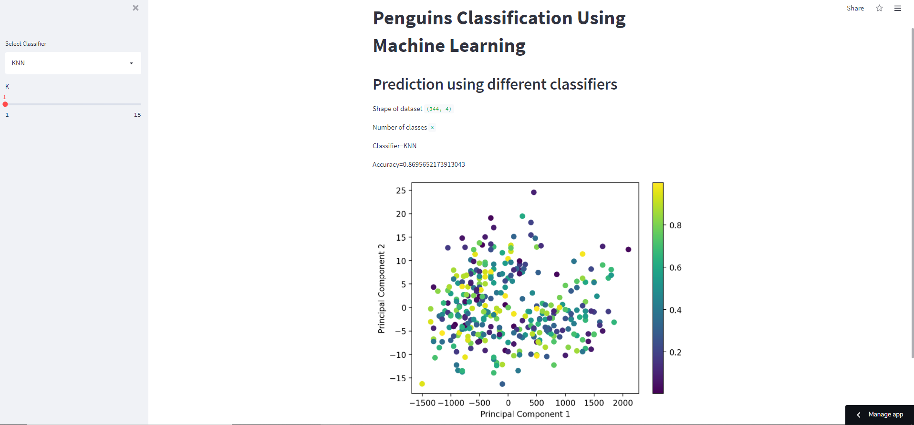

   [# **Penguins Classification Application**](https://share.streamlit.io/wajidumar/streamlit_penguins/main/Penguins_app.py)
***Streamlit*** library is used to develope a web application for penguins classification using ***Machine Learning*** algorithms.

Before starting you have to install the streamlit library using the command ***pip install streamlit*** and after installation **import** ***streamlit*** as **st**. 

As a first step import all the required libraries


```python
import numpy as np
import pandas as pd
import streamlit as st
from sklearn import datasets
from sklearn.decomposition import PCA
from sklearn.model_selection import train_test_split
from sklearn.preprocessing import StandardScaler
from sklearn.ensemble import RandomForestClassifier
from sklearn.neighbors import KNeighborsClassifier
from sklearn.metrics import accuracy_score
from sklearn.svm import SVC
import matplotlib.pyplot as plt
from sklearn.decomposition import PCA
import plotly.graph_objects as go
import plotly.express as px
from tensorflow import keras
```

## Application title
Using the streamlit function you can give a suitable title to the application


```python
st.title("Penguins Classification Using Machine Learning")
st.write("""
## Prediction using different classifiers
""")
```

In the next step we will creat a side bar to select the suitable ***ML classification models***


```python
classifier_name=st.sidebar.selectbox("Select Classifier", ("KNN", "SVM", "Random Forest")) ###Classifiers
```

Lets import the data and separate the ***feature*** and ***target*** variables


```python
data= pd.read_csv("peng.csv") ### Penguins dataset

X=data.iloc[:, -4:] ###Feature variables
y=data.iloc[:, :1] ### Target variable
```

Next, we will add the shape of data and classes on the main page of the application


```python
st.write("Shape of dataset", X.shape)  ## To present the data shape and no. of classes on the main page
st.write("Number of classes", len(np.unique(y)))
```

Now we will define the parameters on the side bar which are specific to each algorithms and necessary to perform the classification


```python
def add_parameter_ui(clf_name):      ### Defining the classifier parameters
    params=dict()
    if clf_name=="KNN":
        K=st.sidebar.slider("K", 1,15 )
        params["K"]=K
    elif clf_name=="SVM":
         C=st.sidebar.slider("C", 0.01,10.0 )
         params["C"]=C
    else:
        max_depth=st.sidebar.slider("max_depth", 2,15 )
        n_estimators=st.sidebar.slider("n_estimators", 1,100 )
        params["max_depth"]=max_depth
        params["n_estimators"]=n_estimators

    return params

params=add_parameter_ui(classifier_name)
```

In the next step we will define the conditions to select the required algorithm from the list


```python
def get_classifier(clf_name, params):     ### Defining the function for the selection of classifiers
    if clf_name=="KNN":
        clf=KNeighborsClassifier(n_neighbors=params["K"])
    
    elif clf_name=="SVM":
         clf=SVC(C=params["C"])
    else:
        clf=RandomForestClassifier(n_estimators=params["n_estimators"],
                                    max_depth=params["max_depth"], random_state=100)

    return clf
clf=get_classifier(classifier_name, params)
```

Lets perform the classification


```python
### Classification
X_train, X_test, y_train, y_test=train_test_split(X,y, test_size=0.2, random_state=100)
clf.fit(X_train, y_train)
y_pred=clf.predict(X_test)
acc=accuracy_score(y_test, y_pred)
```

We will mention the Name of classifier used and the accuracy score on the main page


```python
### To mention the classifier name and the accuracy score on the main page of application
st.write(f"Classifier={classifier_name}")
st.write(f"Accuracy={acc}")
```

In the final step we will plot the classification in the form of scatter point. To dod so we will calculate the ***Principal Component Analysis*** and plot it using matplotlib library


```python
###Visualizing the classification plot
pca=PCA(2)
X_projected=pca.fit_transform(X)
x1 = X_projected[:, 0]
x2 = X_projected[:, 1]

N=344
colors = np.random.rand(N)
fig=plt.figure()
plt.scatter(x1, x2, c=colors, cmap="viridis")
plt.xlabel("Principal Component 1")
plt.ylabel("Principal Component 2")
plt.colorbar()
st.pyplot(fig)
```

In the end, follow the steps to run the application:\
- ***Save*** the file as ***.py*** 
- Open the ***Terminal***
- use the command ***streamlit run "name_of_your_app.py"***
- If it is not working then try the following code ***py -m streamlit run "name_of_your_app.py"***\
After running the code you will get the application page as given below:\

